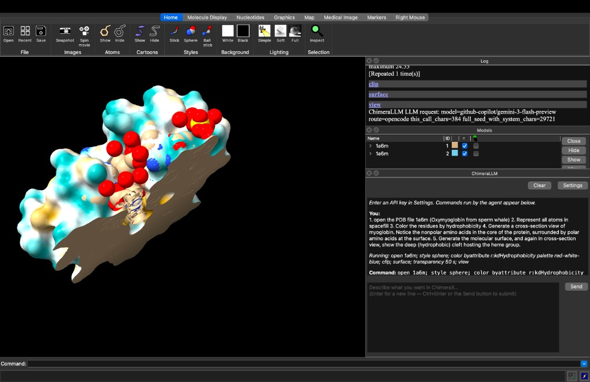

# chimerax-llm

ChimeraX bundle that turns natural language into ChimeraX commands using an LLM agent. Supports any OpenAI-compatible API (OpenRouter, OpenAI, etc.) or GitHub Copilot directly (included with your Copilot subscription).

## Screenshot



**ChimeraLLM** (dock on the right) shows the chat log, running commands, and a **multi-line prompt** (use **Enter** for a new line; **Ctrl+Enter** or **Send** to submit). The 3D view shows the structure after the agent executes your instructions (here: PDB 1a6m, surfaces, hydrophobicity coloring, and cross-section).

## Prerequisites

- **ChimeraX** 1.1 or newer (graphical interface; does not run in `--nogui` mode).
- **Git** (to clone), or download the source as a ZIP.

**For API mode (default):**
- An **API key** for an OpenAI-compatible service.
- The bundle declares a dependency on the Python **`openai`** package; ChimeraX should install it automatically. If you see import errors, run `devel pip install openai` from the ChimeraX command line and restart.

**For GitHub Copilot mode:**
- A **GitHub Copilot** subscription (Free, Pro, Pro+, Business, or Enterprise).
- No external tools needed — authentication is handled directly in the plugin.

## Install from source

1. Clone the repository:

   ```bash
   git clone https://github.com/AminN77/chimerax-llm.git
   cd chimerax-llm
   ```

2. Start **ChimeraX** and open the **Command Line**.

3. Install the bundle:

   ```text
   devel install /full/path/to/chimerax-llm
   ```

   For development (pick up Python edits after restart without reinstalling):

   ```text
   devel install /full/path/to/chimerax-llm user true editable true
   ```

4. **Restart ChimeraX**.

## Configuration

Open the **ChimeraLLM** tool, click **Settings**, and configure one of the two backends:

### Option A: OpenAI-compatible API

| Setting | Description |
|---|---|
| **API endpoint URL** | Leave empty for OpenRouter (`https://openrouter.ai/api/v1`), or enter any OpenAI-compatible endpoint |
| **API key** | Your API key for the chosen endpoint |
| **Model** | Model identifier (default: `gpt-4o`) |
| **Temperature** | Sampling temperature, 0.0 - 2.0 (default: 0.2) |

### Option B: GitHub Copilot

Check **"Use GitHub Copilot instead of API"** in Settings. This calls the Copilot API directly with native tool calling — no API key or separate billing needed. Each user prompt costs exactly **one premium request** regardless of how many tool-calling rounds the agent takes (follow-up rounds are tagged `x-initiator: agent` and are not billed, matching the approach used by [opencode](https://github.com/sst/opencode)).

| Setting | Description |
|---|---|
| **Model** | Pick from the dropdown (GPT-4o, GPT-4.1, Claude Sonnet 4, Gemini 2.5 Pro, etc.) or type any model ID |
| **Login with GitHub** | Click to authenticate via GitHub device flow (one-time setup) |

Available models include GPT-4o, GPT-4.1, GPT-5-mini, Claude Sonnet 4/4.5/4.6, Gemini 2.5 Pro, and o4-mini. Some models like GPT-4.1, GPT-4o, and GPT-5-mini are available at no extra cost beyond your Copilot subscription.

**Max iterations** (shared setting) controls how many tool-calling rounds the agent can take per message (default: 10).

## GitHub Copilot setup

1. Open **ChimeraLLM Settings** in ChimeraX.
2. Check **"Use GitHub Copilot instead of API"**.
3. Click **"Login with GitHub"**.
4. A dialog will show a URL and a one-time code — open the URL in your browser and enter the code.
5. Once authorized, the status will show "Logged in". Pick a model and save.

If you've previously authenticated with [opencode](https://github.com/anomalyco/opencode), the plugin will automatically reuse that token (stored in `~/.local/share/opencode/auth.json`).

## Usage

- **Menu:** Tools > **ChimeraLLM**
- **Command line:**

  ```text
  chimerallm
  ```

  With an inline prompt:

  ```text
  chimerallm fetch 1ubq and color it by secondary structure
  ```

Type natural language in the **prompt area** at the bottom of the panel. It supports **multiple lines**; press **Enter** for a new line and **Ctrl+Enter** (or **Send**) to submit. The agent runs ChimeraX commands, can read session state, and shows command output in the chat.

## Updating

After `git pull`, run `devel install` again with the same path and options, then restart ChimeraX.

## Architecture

See [architecture.md](architecture.md) for a detailed overview of the codebase, threading model, and backend design.

## More information

- ChimeraX `devel install` options: [Command: devel](https://rbvi.ucsf.edu/chimerax/docs/user/commands/devel.html)
- Bundle development overview: [Building and distributing bundles](https://www.cgl.ucsf.edu/chimerax/docs/devel/writing_bundles.html)
